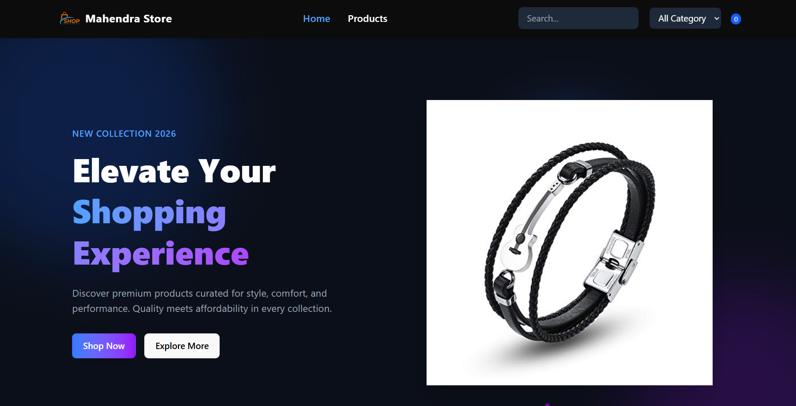
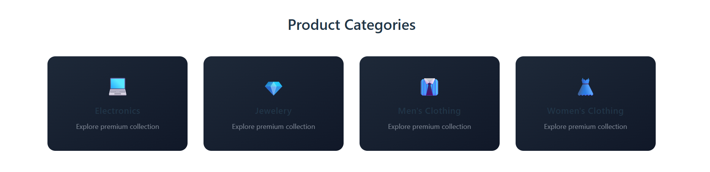
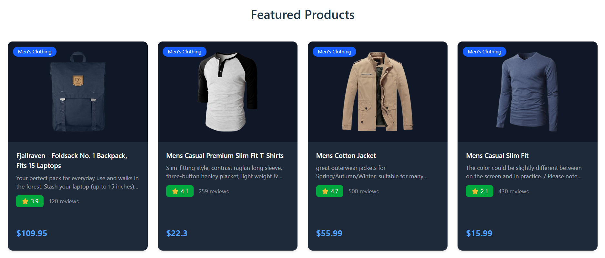
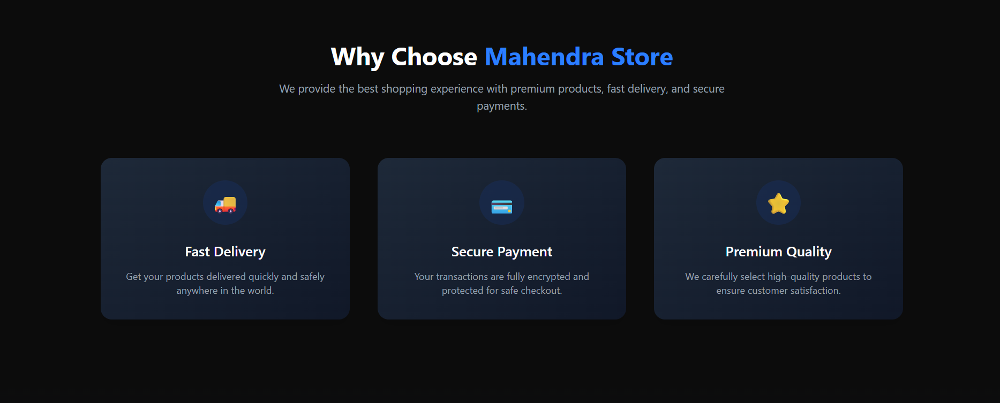
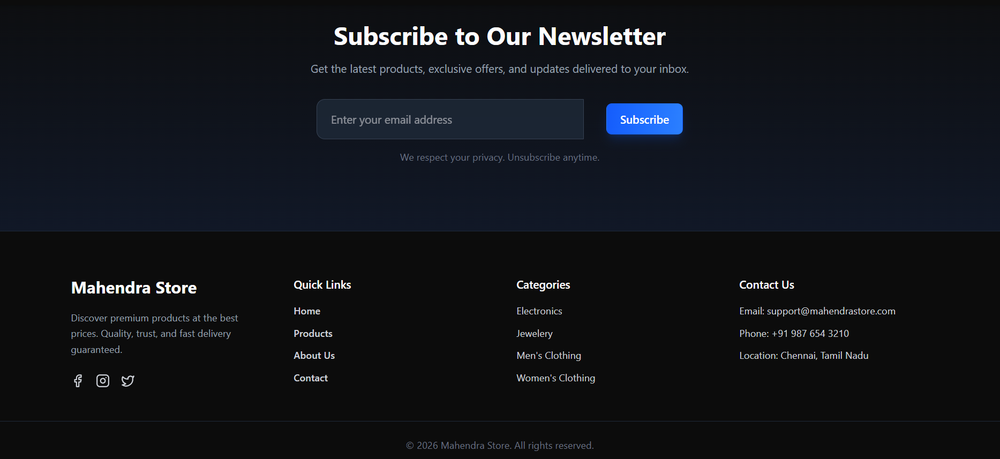
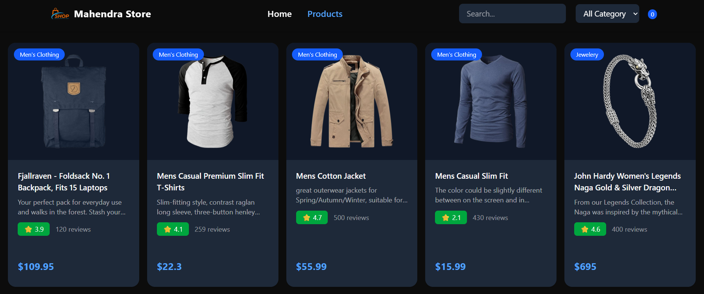
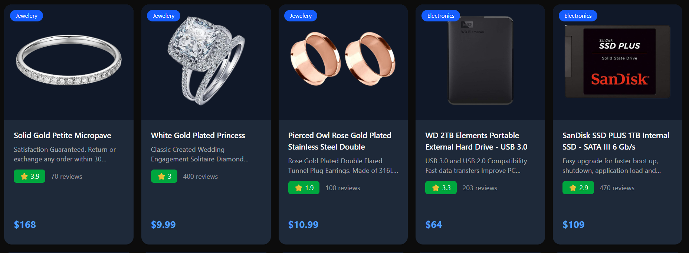
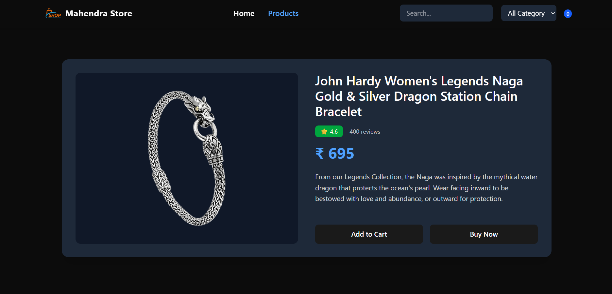

# React E-Commerce Frontend

## 📌 Overview
Customized React E-Commerce Frontend project built during my break to enhance full-stack development skills.  
Features include product catalog, category filtering, search, and responsive UI.

## 🛠️ Tech Stack
- React
- Tailwind CSS
- React Router
- Axios

## ✨ Features
- Product listing from API
- Product detail pages
- Category filtering
- Search functionality
- Responsive design (mobile, tablet, desktop)

## 🚀 How to Run
1. Clone the repo:
   ```bash
   git clone https://github.com/Bandi-Mahendra/react-ecommerce-frontend.git
   cd react-ecommerce-frontend
   ```
2. Install dependencies:
   ```bash
   npm install
   ```
3. Run locally:
   ```bash
   npm run dev
   ```
4. Open in browser:
   ```bash
   http://localhost:5173
   ```

## 📸 Home Page






## 📸 Product Page




## 📦 Future Improvements
- Backend integration with Node.js/Express
- User authentication (login/register)
- Cart persistence with database
- Payment gateway integration

## 👤 Author
Bandi Mahendra  
React E-Commerce Frontend Project 
